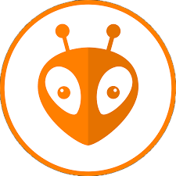
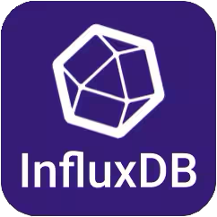
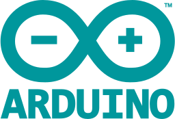

# Hi there :wave:

I'm Alex Mot. I am currently enrolled in at UPT Racing Team, a formula student team from Timișoara, Romania.

## Some of my interests: 
&nbsp;&nbsp;&nbsp;&nbsp;&nbsp;&nbsp;&nbsp;&nbsp;&nbsp;&nbsp;&nbsp;&nbsp;&nbsp;&nbsp;&nbsp;&nbsp;&nbsp;&nbsp;&nbsp;&nbsp;&nbsp;&nbsp;&nbsp;&nbsp;&nbsp;&nbsp;&nbsp;&nbsp;&nbsp;&nbsp;&nbsp;&nbsp;&nbsp;&nbsp;&nbsp;&nbsp;&nbsp;&nbsp;&nbsp;&nbsp;&nbsp;&nbsp;&nbsp;&nbsp;&nbsp;&nbsp;&nbsp;&nbsp;

- I've worked on getting ESP32-Cam to stream over Internet using Husarnet. Sadly, the framerate was astonishingly low.
- Now I'm spending my time adding new features to our robotics team's Rover.
- Update March 2024: The rough design of the Can is done, we are making adjustments regarding the sensors and power supply. 
- Update June 2024: We (Team HELIOS Arad) encountered many problems at our Can. But, slowly and steadily, we finished the CanSat 2024 competition. I will make a separate repo about this.
  
## Other hobbies:

<!---
alexandrumot/alexandrumot is a ✨ special ✨ repository because its `README.md` (this file) appears on your GitHub profile.
You can click the Preview link to take a look at your changes.
--->
