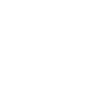

# Hi there :wave:
My name is Alex Mot. I'm a fan of minimalist design.

## My stack: 
&nbsp;&nbsp;&nbsp;&nbsp;&nbsp;&nbsp;&nbsp;&nbsp;&nbsp;&nbsp;&nbsp;&nbsp;&nbsp;&nbsp;&nbsp;&nbsp;&nbsp;&nbsp;&nbsp;&nbsp;&nbsp;&nbsp;&nbsp;

- I’m currently working on my portfolio website.
  
## Other hobbies:

&nbsp;&nbsp;&nbsp;&nbsp;&nbsp;&nbsp;

<!---
alexandrumot/alexandrumot is a ✨ special ✨ repository because its `README.md` (this file) appears on your GitHub profile.
You can click the Preview link to take a look at your changes.
--->
